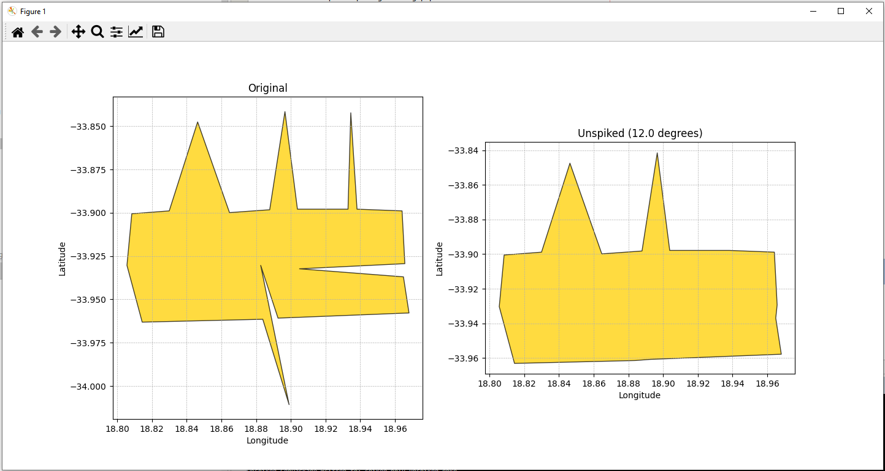

# Unspike gpkg (Stand-alone script version with UI)

This script processes polygons in a GeoPackage file, removing spikes by filtering out vertices that form angles sharper than a specified threshold.



## Features

- Reads polygons from a GeoPackage file.
- Removes spikes by filtering out vertices forming angles sharper than a specified threshold.
- Plots the original and filtered polygons side by side.
- Writes the filtered polygons to a new GeoPackage file.

## Requirements

- Python 3.x
- fiona
- numpy
- pyproj
- shapely
- matplotlib
- argparse

## Installation

Install the required packages using pip:

```
pip install fiona numpy pyproj shapely matplotlib argparse
```

## Usage

Run the script with the following command-line arguments:

```
python unspike_ui.py -i path/to/your/file.gpkg -a 10.0
```
- `-i, --input`: Path to the input GeoPackage file.
- `-a, --angle`: Minimum angle threshold in degrees.

## Flow Diagram


